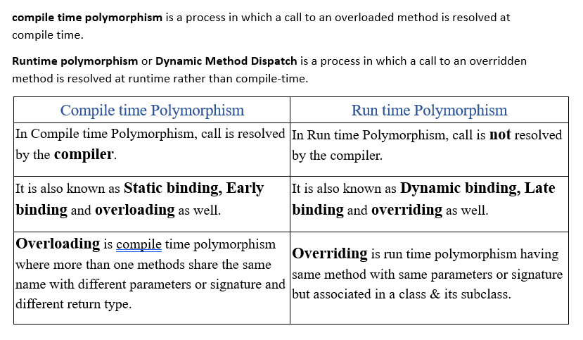

### Polymorphism in Java

**Definition**: Polymorphism is one of the core concepts of object-oriented programming (OOP) that allows objects of different classes to be treated as objects of a common superclass. It enables a single interface to represent different underlying forms (data types/objects). The term "polymorphism" means "many shapes" or "many forms."
The most common use of polymorphism in OOP occurs when a parent class reference is used to refer to a child class object.


### Need for Polymorphism in Java

1. **Code Reusability**: Polymorphism allows methods to use objects of different types, making the code more reusable.
2. **Flexibility and Maintainability**: Polymorphism makes it easier to extend and maintain the code by allowing new classes to be added with minimal changes to the existing code.
3. **Simplified Code**: It helps in writing more generic and simplified code since the same method can operate on different types of objects.
4. **Dynamic Method Binding**: Polymorphism allows the execution of the appropriate method based on the object type at runtime, enabling dynamic method dispatch.

### Advantages of Polymorphism

1. **Improved Code Readability**: It makes the code easier to read and understand by allowing the use of a single method name for different types of objects.
2. **Reduced Code Complexity**: Polymorphism reduces the complexity of the code by abstracting the method implementation.
3. **Enhanced Flexibility**: It provides flexibility to add new classes and methods without altering the existing code.
4. **Better Maintainability**: Polymorphism makes the code easier to maintain by promoting the use of interfaces and abstract classes.

### Implementing Polymorphism in Java

Polymorphism can be implemented in Java in two ways:
1. **Compile-time Polymorphism (Method Overloading)**
2. **Runtime Polymorphism (Method Overriding)**

#### 1. Compile-time Polymorphism (Method Overloading)

**Definition**: Compile-time polymorphism, also known as method overloading, occurs when multiple methods have the same name but different parameter lists (number or type of parameters). The method to be called is determined at compile time.

**Example**:
```java
class MathOperations {
    // Overloaded method with two int parameters
    int add(int a, int b) {
        return a + b;
    }

    // Overloaded method with three int parameters
    int add(int a, int b, int c) {
        return a + b + c;
    }

    // Overloaded method with two double parameters
    double add(double a, double b) {
        return a + b;
    }
}

public class Main {
    public static void main(String[] args) {
        MathOperations mathOps = new MathOperations();
        
        // Calling the overloaded methods
        System.out.println("Sum of 2 and 3: " + mathOps.add(2, 3)); // Calls add(int, int)
        System.out.println("Sum of 1, 2, and 3: " + mathOps.add(1, 2, 3)); // Calls add(int, int, int)
        System.out.println("Sum of 2.5 and 3.5: " + mathOps.add(2.5, 3.5)); // Calls add(double, double)
    }
}
```

**Explanation**:
- **Class MathOperations**: Contains three overloaded `add()` methods with different parameter lists.
- **Main Class**: The calls to `mathOps.add(2, 3)`, `mathOps.add(1, 2, 3)`, and `mathOps.add(2.5, 3.5)` are resolved at compile time based on the method signatures.

#### 2. Runtime Polymorphism (Method Overriding)

**Definition**: Runtime polymorphism, also known as method overriding, occurs when a subclass provides a specific implementation for a method that is already defined in its superclass. The method to be called is determined at runtime based on the actual object's type.

**Example**:
```java
class Animal {
    void sound() {
        System.out.println("Animal makes a sound");
    }
}

class Dog extends Animal {
    @Override
    void sound() {
        System.out.println("Dog barks");
    }
}

class Cat extends Animal {
    @Override
    void sound() {
        System.out.println("Cat meows");
    }
}

public class Main {
    public static void main(String[] args) {
        Animal myAnimal;

        myAnimal = new Dog();
        myAnimal.sound();  // Calls the overridden method in Dog

        myAnimal = new Cat();
        myAnimal.sound();  // Calls the overridden method in Cat
    }
}
```

**Explanation**:
- **Class Animal**: Contains a method `sound()` that prints "Animal makes a sound".
- **Class Dog**: Overrides the `sound()` method to print "Dog barks".
- **Class Cat**: Overrides the `sound()` method to print "Cat meows".
- **Main Class**: The `myAnimal` reference is used to refer to `Dog` and `Cat` objects. The method `sound()` calls the appropriate overridden method based on the actual object's type at runtime.

### Difference Between Compile-time Polymorphism and Runtime Polymorphism



| Feature                       | Compile-time Polymorphism (Method Overloading) | Runtime Polymorphism (Method Overriding)  |
|-------------------------------|------------------------------------------------|--------------------------------------------|
| **Binding Time**              | Compile time                                   | Runtime                                    |
| **Method Resolution**         | Based on method signature                      | Based on the actual object's type          |
| **Method Names**              | Same name, different parameter list            | Same name, same parameter list             |
| **Inheritance Requirement**   | Not required                                   | Required                                   |
| **Performance**               | Faster, as it is resolved at compile time      | Slightly slower, as it is resolved at runtime|
| **Example**                   | Method overloading                             | Method overriding                          |

## Examples

### Method Overloading with `println` Method

The `println` method is overloaded to handle different types of arguments, such as `int`, `double`, `char`, `String`, etc. Each version of the method has the same name but a different parameter list.

### Example

```java
public class Main {
    public static void main(String[] args) {
        // Different overloaded versions of println method
        System.out.println(42);          // Calls println(int)
        System.out.println(3.14);        // Calls println(double)
        System.out.println('A');         // Calls println(char)
        System.out.println("Hello");     // Calls println(String)
        System.out.println(true);        // Calls println(boolean)
        
        // Custom overloaded method example
        MathOperations mathOps = new MathOperations();
        System.out.println("Sum of 2 and 3: " + mathOps.add(2, 3)); // Calls add(int, int)
        System.out.println("Sum of 1, 2, and 3: " + mathOps.add(1, 2, 3)); // Calls add(int, int, int)
        System.out.println("Sum of 2.5 and 3.5: " + mathOps.add(2.5, 3.5)); // Calls add(double, double)
    }
}

class MathOperations {
    // Overloaded method with two int parameters
    int add(int a, int b) {
        return a + b;
    }

    // Overloaded method with three int parameters
    int add(int a, int b, int c) {
        return a + b + c;
    }

    // Overloaded method with two double parameters
    double add(double a, double b) {
        return a + b;
    }
}
```

### Explanation

1. **Overloaded `println` Method**:
    - `System.out.println(42);` calls the `println(int x)` method, which prints an integer.
    - `System.out.println(3.14);` calls the `println(double x)` method, which prints a double.
    - `System.out.println('A');` calls the `println(char x)` method, which prints a character.
    - `System.out.println("Hello");` calls the `println(String x)` method, which prints a string.
    - `System.out.println(true);` calls the `println(boolean x)` method, which prints a boolean value.

2. **Custom Overloaded Method Example**:
    - `mathOps.add(2, 3);` calls the `add(int a, int b)` method, which adds two integers.
    - `mathOps.add(1, 2, 3);` calls the `add(int a, int b, int c)` method, which adds three integers.
    - `mathOps.add(2.5, 3.5);` calls the `add(double a, double b)` method, which adds two double values.

### Key Points

- **Method Signature**: The method signature includes the method name and the parameter list (number, type, and order of parameters). The return type is not considered part of the method signature for overloading.
- **Compile-time Resolution**: The compiler uses the method signature to determine which overloaded method to call. This resolution happens at compile time, making it an example of compile-time polymorphism.
- **Static Binding**: Since the method call is resolved at compile time, it is an example of static binding.

By using method overloading, Java allows the same method name to handle different types of data, providing flexibility and improving code readability. The `println` method in the `System.out` class is a classic example of this concept.


### Example of Method Overriding

**Bank Interface**:
```java
interface Bank {
    // Abstract method to be overridden by implementing classes
    double getInterestRate();
}
```

**SBI Class**:
```java
class SBI implements Bank {
    @Override
    public double getInterestRate() {
        return 5.5; // SBI's interest rate
    }
}
```

**HDFC Class**:
```java
class HDFC implements Bank {
    @Override
    public double getInterestRate() {
        return 6.0; // HDFC's interest rate
    }
}
```

**ICICI Class**:
```java
class ICICI implements Bank {
    @Override
    public double getInterestRate() {
        return 6.5; // ICICI's interest rate
    }
}
```

**Main Class**:
```java
public class Main {
    public static void main(String[] args) {
        // Creating instances of different banks
        Bank sbi = new SBI();
        Bank hdfc = new HDFC();
        Bank icici = new ICICI();

        // Displaying the interest rates of different banks
        System.out.println("SBI Interest Rate: " + sbi.getInterestRate() + "%");
        System.out.println("HDFC Interest Rate: " + hdfc.getInterestRate() + "%");
        System.out.println("ICICI Interest Rate: " + icici.getInterestRate() + "%");
    }
}
```

### Explanation

1. **Bank Interface**:
    - The `Bank` interface declares an abstract method `getInterestRate()`, which must be overridden by any class that implements the interface.

2. **SBI Class**:
    - The `SBI` class implements the `Bank` interface and provides a specific implementation for the `getInterestRate()` method, returning an interest rate of 5.5%.

3. **HDFC Class**:
    - The `HDFC` class implements the `Bank` interface and provides a specific implementation for the `getInterestRate()` method, returning an interest rate of 6.0%.

4. **ICICI Class**:
    - The `ICICI` class implements the `Bank` interface and provides a specific implementation for the `getInterestRate()` method, returning an interest rate of 6.5%.

5. **Main Class**:
    - In the `main` method, instances of `SBI`, `HDFC`, and `ICICI` are created, and the overridden `getInterestRate()` method is called for each instance. The interest rates of different banks are displayed.

### Key Points

- **Method Overriding**: Each bank class (`SBI`, `HDFC`, `ICICI`) provides its own implementation of the `getInterestRate()` method, overriding the abstract method declared in the `Bank` interface.
- **Polymorphism**: The `Bank` interface reference is used to refer to objects of different bank classes. The appropriate overridden method is called based on the actual object type at runtime.
- **Dynamic Binding**: The method call is resolved at runtime, making it an example of runtime polymorphism (dynamic method dispatch).

This example demonstrates how method overriding allows different classes to provide specific implementations for methods declared in an interface, enabling polymorphic behavior in Java.

Certainly! Method overriding is a powerful feature in Java that allows a subclass to provide a specific implementation for a method that is already defined in its superclass. One commonly overridden method is the `toString()` method from the `Object` class. The `toString()` method is used to provide a string representation of an object.

### Example of Method Overriding with `toString()`

Let's create an example where we have a `Person` class and a `Student` class that extends `Person`. We'll override the `toString()` method in both classes to provide meaningful string representations.

**Person Class**:
```java
class Person {
    private String name;
    private int age;

    // Constructor
    public Person(String name, int age) {
        this.name = name;
        this.age = age;
    }

    // Overriding the toString() method
    @Override
    public String toString() {
        return "Person{name='" + name + "', age=" + age + "}";
    }
}
```

**Student Class**:
```java
class Student extends Person {
    private String major;

    // Constructor
    public Student(String name, int age, String major) {
        super(name, age);
        this.major = major;
    }

    // Overriding the toString() method
    @Override
    public String toString() {
        return "Student{" + super.toString() + ", major='" + major + "'}";
    }
}
```

**Main Class**:
```java
public class Main {
    public static void main(String[] args) {
        // Creating a Person object
        Person person = new Person("John Doe", 45);
        System.out.println(person.toString()); // Calls the overridden toString() method in Person

        // Creating a Student object
        Student student = new Student("Jane Smith", 20, "Computer Science");
        System.out.println(student.toString()); // Calls the overridden toString() method in Student
    }
}
```

### Explanation

1. **Person Class**:
    - **Fields**: The `Person` class has private fields `name` and `age`.
    - **Constructor**: The constructor initializes the `name` and `age` fields.
    - **toString() Method**: The `toString()` method is overridden to provide a string representation of a `Person` object, including the `name` and `age` fields.

2. **Student Class**:
    - **Fields**: The `Student` class extends `Person` and adds a private field `major`.
    - **Constructor**: The constructor initializes the `name` and `age` fields by calling the superclass constructor using `super()`, and initializes the `major` field.
    - **toString() Method**: The `toString()` method is overridden to provide a string representation of a `Student` object. It calls the `toString()` method of the superclass (`Person`) and includes the `major` field.

3. **Main Class**:
    - **Person Object**: An instance of `Person` is created, and the overridden `toString()` method in `Person` is called to print the string representation of the `Person` object.
    - **Student Object**: An instance of `Student` is created, and the overridden `toString()` method in `Student` is called to print the string representation of the `Student` object.

### Key Points

- **Method Overriding**: The `toString()` method is overridden in both `Person` and `Student` classes to provide specific string representations.
- **Polymorphism**: The `toString()` method call is resolved at runtime based on the actual object's type.
- **Dynamic Binding**: The method call is bound to the method implementation at runtime, demonstrating runtime polymorphism.

This example shows how method overriding can be used to provide meaningful string representations for objects by overriding the `toString()` method from the `Object` class.
